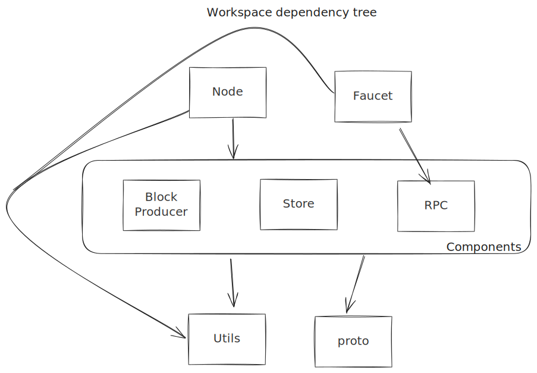

# Navigating the codebase

The code is organised using a Rust workspace with seprate crates for the node and faucet binaries, a crate for each node
component, a couple of gRPC-related codegen crates, and a catch-all utilities crate.

The primary artifacts are the node and faucet binaries. The library crates are not intended for external usage, but
instead simply serve to enforce code organisation and decoupling.

| Crate            | Description                                                                                                                                              |
| ---------------- | -------------------------------------------------------------------------------------------------------------------------------------------------------- |
| `node`           | The node executable. Configure and run the node and its components.                                                                                      |
| `faucet`         | A reference faucet app implementation used by the official Miden faucet.                                                                                 |
| `block-producer` | Block-producer component implementation.                                                                                                                 |
| `store`          | Store component implementation.                                                                                                                          |
| `rpc`            | RPC component implementation.                                                                                                                            |
| `proto`          | Contains and exports all protobuf definitions.                                                                                                           |
| `rpc-proto`      | Contains the RPC protobuf definitions. Currently this is an awkward clone of `proto` because we re-use the definitions from the internal protobuf types. |
| `utils`          | Variety of utility functionality.                                                                                                                        |
| `test-macro`     | Provides a procedural macro to enable tracing in tests.                                                                                                  |

-------

> [!NOTE]
> [`miden-base`](https://github.com/0xPolygonMiden/miden-base) is an important dependency which
> contains the core Miden protocol definitions e.g. accounts, notes, transactions etc.

