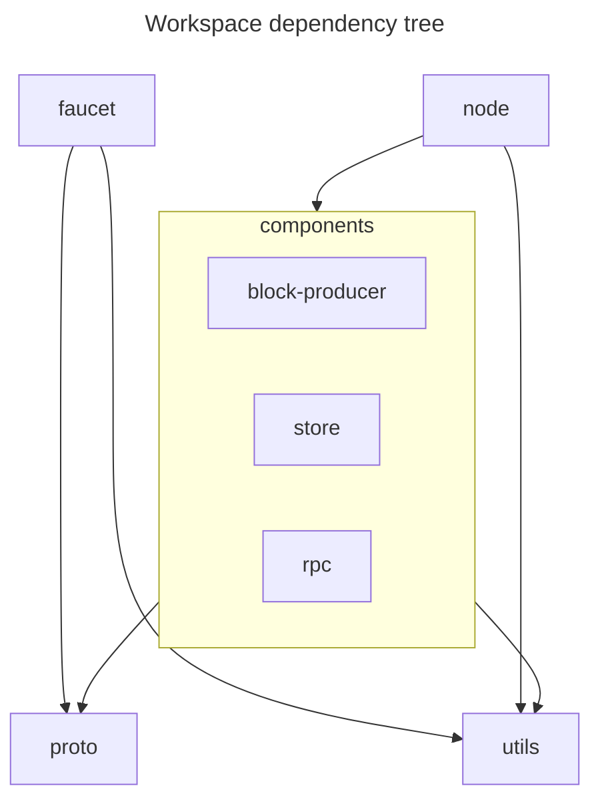

# Navigating the codebase

The code is organised using a Rust workspace with seprate crates for the node and faucet binaries, a crate for each node
component, a couple of gRPC-related codegen crates, and a catch-all utilities crate.

The primary artifacts are the node and faucet binaries. The library crates are not intended for external usage, but
instead simply serve to enforce code organised and decoupling. The node binary is used to launch the components i.e. we
have a single binary with subcommands for each component (and running them all as a single process).

We also have a proc-macro crate `test-macro` which provides a helpful utility macro to enable tracing for tests. There is
also an additional `rpc-proto` crate which hosts the external gRPC schema (as compared to the internal schema used
to communicate between node components). In other words, this is intended to be the outside world facing schema hosted
by the RPC component. At the moment this is simply a copy of the internal schema since the external query is often
simply forwarded as is to an internal component. This will change eventually.
